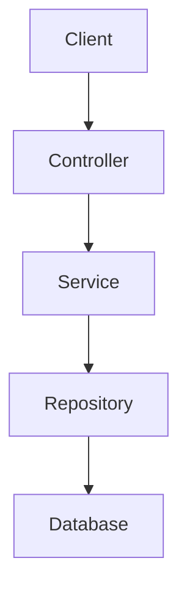

# Documentation Workflow

This steering document provides guidelines and workflows for creating and maintaining high-quality documentation for the Summer Core framework.

## Documentation Structure

The Summer Core documentation follows a structured approach similar to Spring Framework's documentation as example:

```
docs/
├── index.md                  # Landing page
├── overview/                 # Framework overview
│   ├── introduction.md
│   ├── getting-started.md
│   └── architecture.md
├── core/                     # Core container
│   ├── ioc.md
│   ├── beans.md
│   └── context.md
├── aop/                      # AOP documentation
│   ├── introduction.md
│   └── usage.md
├── event/                    # Event system
│   ├── introduction.md
│   └── usage.md
├── data/                     # Data access
│   └── repositories.md
├── integration/              # Integration features
│   └── overview.md
├── testing/                  # Testing support
│   └── overview.md
└── api-reference/           # API reference
    └── modules.md
```

## Documentation Standards

### General Guidelines

1. **Be Clear and Concise**: Use simple language and avoid jargon
2. **Be Consistent**: Use consistent terminology and formatting
3. **Be Complete**: Cover all aspects of the feature
4. **Be Accurate**: Ensure all information is correct and up-to-date
5. **Be Helpful**: Focus on helping the reader understand and use the feature

### Page Structure

Each documentation page should follow this structure:

1. **Title**: Clear, descriptive title
2. **Introduction**: Brief overview of the topic
3. **Main Content**: Detailed explanation of the topic
4. **Examples**: Code examples demonstrating the feature
5. **Best Practices**: Guidelines for using the feature effectively

### Code Examples

Code examples should be:

1. **Complete**: Include all necessary imports and context
2. **Concise**: Focus on the feature being demonstrated
3. **Correct**: Ensure the code works as expected
4. **Commented**: Include comments explaining key points
5. **Consistent**: Follow the project's coding style

## Documentation Workflow

### Creating New Documentation

1. **Plan**: Identify the topic and scope of the documentation
2. **Research**: Gather information about the topic
3. **Outline**: Create an outline of the documentation
4. **Write**: Write the documentation following the standards
5. **Review**: Review the documentation for accuracy and completeness
6. **Publish**: Add the documentation to the project

### Updating Existing Documentation

1. **Identify**: Identify the documentation that needs to be updated
2. **Review**: Review the current documentation
3. **Update**: Make the necessary changes
4. **Test**: Test any code examples
5. **Review**: Review the updated documentation
6. **Publish**: Update the documentation in the project

## MkDocs Configuration

The Summer Core documentation uses MkDocs with the Material theme. The configuration is in the `mkdocs.yml` file:

```yaml
site_name: Summer Core Framework
theme:
  name: material
  features:
    - navigation.tabs
    - navigation.sections
    - navigation.expand
    - navigation.indexes
    - content.code.copy

plugins:
  - search
  - mkdocstrings:
      handlers:
        python:
          selection:
            docstring_style: google
          rendering:
            show_source: true
            show_if_no_docstring: false
            heading_level: 3

markdown_extensions:
  - admonition
  - pymdownx.highlight
  - pymdownx.superfences:
      custom_fences:
        - name: mermaid
          class: mermaid
          format: !!python/name:pymdownx.superfences.fence_code_format
  - pymdownx.tabbed
  - pymdownx.details
  - pymdownx.snippets
  - toc:
      permalink: true
```

## Documentation Features

### Admonitions

Use admonitions to highlight important information:

```markdown
!!! note "Note"
    This is a note.

!!! tip "Tip"
    This is a tip.

!!! warning "Warning"
    This is a warning.

!!! danger "Danger"
    This is a danger notice.
```

### Code Blocks

Use code blocks with syntax highlighting:

```markdown
```python
from summer_core.decorators import Component

@Component
class MyComponent:
    pass
```
```

### Tabbed Content

Use tabbed content for different options:

```markdown
=== "Option 1"
    This is option 1.

=== "Option 2"
    This is option 2.
```

### Diagrams

Use Mermaid diagrams for visualizations:

```markdown

```

## Building and Serving Documentation

### Building Documentation

To build the documentation:

```bash
mkdocs build
```

This will create a `site` directory with the static site.

### Serving Documentation Locally

To serve the documentation locally:

```bash
mkdocs serve
```

This will start a local server at http://127.0.0.1:8000/.

### Publishing Documentation

To publish the documentation to GitHub Pages:

```bash
mkdocs gh-deploy
```

This will build the documentation and push it to the `gh-pages` branch.

## Documentation Review Checklist

Before publishing documentation, ensure it meets these criteria:

- [ ] Follows the documentation structure
- [ ] Follows the documentation standards
- [ ] Includes clear and concise explanations
- [ ] Includes relevant code examples
- [ ] Includes best practices
- [ ] Code examples are complete, concise, and correct
- [ ] No spelling or grammar errors
- [ ] Links work correctly
- [ ] Images display correctly
- [ ] Diagrams are clear and helpful
- [ ] Admonitions are used appropriately
- [ ] Tabbed content is used effectively
- [ ] Documentation builds without errors
- [ ] Documentation displays correctly in the browser

## Adding New Documentation Sections

To add a new documentation section:

1. Create a new directory in the `docs` directory
2. Create the necessary markdown files
3. Update the `nav` section in `mkdocs.yml`
4. Add the new section to the documentation structure in this document

## Updating API Reference

The API reference is generated automatically from docstrings using the `mkdocstrings` plugin. To update the API reference:

1. Ensure all modules, classes, and functions have proper docstrings
2. Update the `modules.md` file to include any new modules
3. Build the documentation to verify the API reference is generated correctly

## Documentation Maintenance

Regular maintenance tasks:

1. Review and update documentation for each release
2. Check for broken links and fix them
3. Update code examples to match the current API
4. Add documentation for new features
5. Improve existing documentation based on feedback

## Getting Help

If you need help with documentation:

1. Check the MkDocs documentation: https://www.mkdocs.org/
2. Check the Material for MkDocs documentation: https://squidfunk.github.io/mkdocs-material/
3. Check the mkdocstrings documentation: https://mkdocstrings.github.io/
4. Ask for help in the project's communication channels